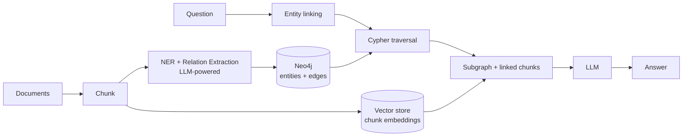
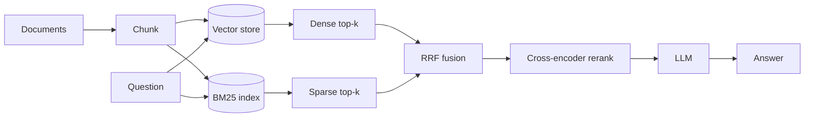
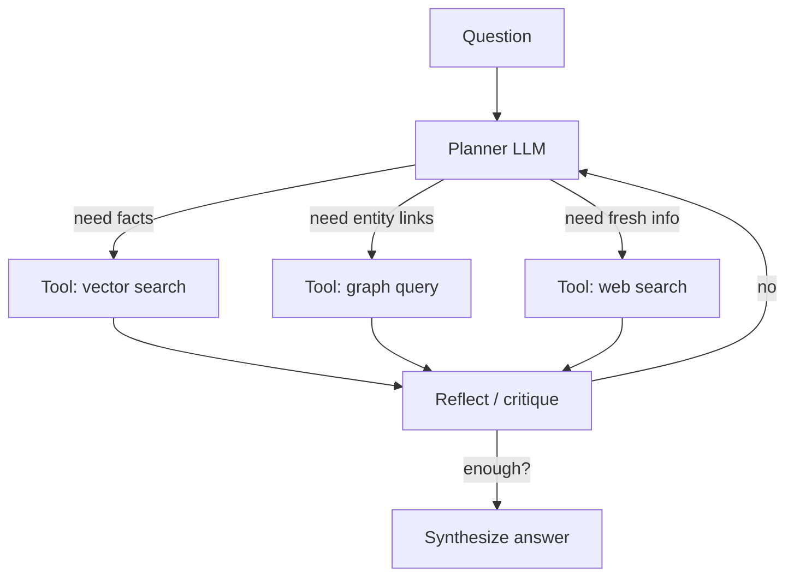

# 02 — Architecture

Side-by-side pipelines. All three start from the same corpus.

## KG-RAG

Two stores: the graph holds structure, the vector store still holds chunks (so we can quote sources).

## Hybrid RAG

Single corpus, two views of it, fused then reranked.

## Agentic RAG

A loop, not a pipeline. State accumulates across iterations.

## Shared components (`src/rag_compare/common/`)

- Chunker
- Embedding client
- LLM client
- Eval harness with golden Q&A set

Each pattern reuses these so differences are attributable to the *pattern*, not the plumbing.
