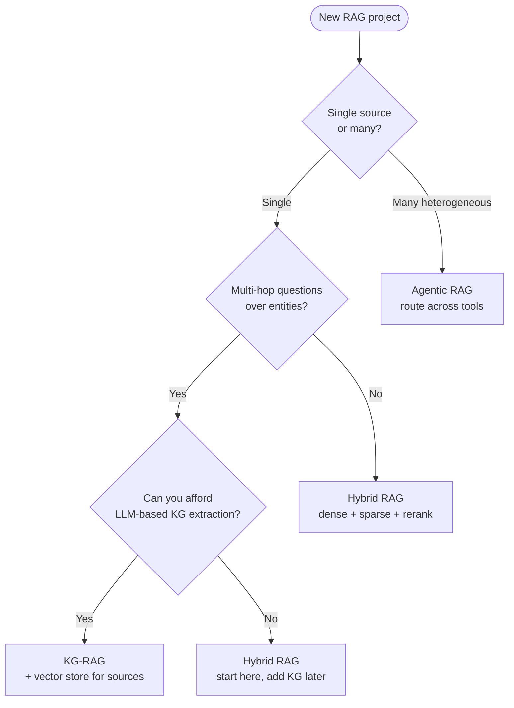

# 04 — When to use which

A decision tree, not a religion. Most production systems combine these.



## Use-case fit

| Use case | Recommended | Why |
|---|---|---|
| Customer support over docs | Hybrid | Mixed exact terms (error codes) + semantic |
| Biomedical literature QA | KG-RAG | Drug–gene–disease relationships matter |
| Legal contract analysis | KG-RAG or Agentic | Entity relationships, cross-document reasoning |
| Financial 10-K analysis | Hybrid + Agentic | Need exact figures + semantic context + tables |
| Code search | Hybrid | Identifier exact matches dominate |
| Research assistant | Agentic | Plans, searches, synthesizes |
| Internal wiki Q&A | Hybrid | Default — start here |

## Anti-patterns

- **KG-RAG on unstructured chat logs** — extraction is noisy, ROI poor.
- **Agentic RAG when latency matters** — agents loop; users wait.
- **Hybrid RAG for genuinely multi-hop** — fusion doesn't help when the answer requires *joining* facts across docs.

## Stacking

The mature production pattern:

```
Agent
  ├── Tool: hybrid retriever  (default)
  ├── Tool: KG retriever      (for entity/relationship questions)
  └── Tool: SQL / web / etc.  (when needed)
```

Build the parts independently (this repo), then compose them.
